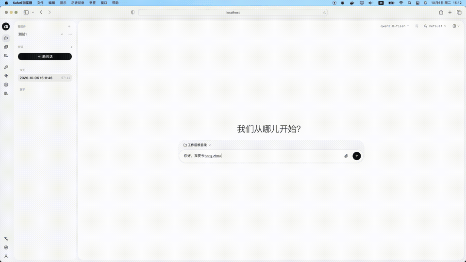

# 多智能体智能差旅助手（AgentScope 2.0.x · 仿阿里商旅）

基于 **AgentScope 2.0** 从零实现的企业级多智能体差旅助手：把一句自然语言差旅诉求拆成机票、酒店、行程、审批等子任务，交由不同子 Agent 协同完成，卡片化流式呈现。实现「出差事项收集 → 行程规划 → 差标核对 → 申请单提交」的业务闭环，落成一条可流式、可观测的智能体链路。智能体、工具、中间件、事件流等框架已有的能力一律 `import agentscope` 调用，本仓库只实现框架没有的部分 —— 差旅业务域、工具集、知识库策略、长期记忆、评测与业务 API。

> ⚠️ 本仓库的「下单」环节止于**提交出差申请单 + HITL 人工确认**，没有真实的出票 / 预订工具。
> 业务架构参考[阿里商旅 AliGo 博客](https://agentscope.io/blog/alibaba-business-travel/)（原文存档见 [`docs/博客原文-Alibaba-Business-Travel.md`](docs/博客原文-Alibaba-Business-Travel.md)）。

## ✨ 核心亮点

### 🎯 多智能体编排

- 主规划智能体 `main_plan` + 四个专家子智能体：意图识别 `intent`、政策问答 `policy_rag`、申请单 `approval`、订单查询 `order_query`，由版本化注册表统一装配。
- 意图识别独立成体：8 类意图，两段式输出（推理过程 + 结构化决策），并产出 query 改写。
- 模型可见工具 7 个，统一 `ToolChunk` 卡片契约（`{ok, summary, card, items, needs}`），前端按 `card` 字段选渲染器。

### ⚡ 快慢车道分流

- 规则精确命中的固定话术走**快车道**：`LaneRouterMiddleware` 短路本轮第一次模型调用，不做多余推理。
- 复杂长句走**慢车道**：交由主智能体 ReAct 执行；多意图拆解由模型按需调用只读工具 `recognize_intent` 完成。
- 离线评测的 34 条黄金样例中快车道 16 条，实测车道判定 34/34。

### 🧠 动态 Prompt 与两层记忆

- `ContextInjectionMiddleware` 在每次模型调用前，把用户画像与已收集要素拼进 system prompt。
- 短期记忆由框架会话管理；长期记忆 = 结构化画像（Postgres JSONB）+ 语义召回（Milvus 派生集合），显式读写面 `/api/v1/memory/**`。

### 📚 企业知识库

- Milvus **单集合** + `metadata` JSON 路径过滤：一套集合承载全部知识库，租户 / 知识库双向隔离且读写两端强制。
- 密集向量检索（HNSW / COSINE）+ 可选 LLM 重排；向量模型由知识库凭据决定——有密钥走真实提供方，没有才钉 Mock。
- 检索护栏：读操作 5 秒截止 + 熔断（连续 3 次失败开路 30 秒），Milvus 卡住时对话降级而不是假死。

### 🛡️ 稳定性保障

- 自研熔断器（框架没有这个能力），全体智能体共享；模型调用按钟超时（框架会吞 `CancelledError`，不能用 `wait_for` 判断）。
- 回复守卫：剥离工具轮里的过程叙述与独白草稿，清洗混进上屏文本的框架内部标记（如 `[tool_result cleared by postprune]`），只对「没有工具依据的差标断言」这一窄条件拦截重说。
- 申请单等非只读操作走 HITL 人工确认；保留身份 `aligo-system` 在三条通道统一 403。

### 🏗️ 企业级工程化

- 配置三级合并（`base.yaml` → `{env}.yaml` → `ALIGO__` 环境变量），**未知键启动即崩**，不静默忽略。
- 质量闸门全部是可执行命令：单测、文档双闸门、端到端冒烟、离线评测、并发正确性，见 `make help`。

## 系统架构

```text
浏览器（web/frontend，构建产物由 app 同源托管）
   │  X-User-ID 或 Bearer JWT
   ▼
ASGI 中间件链：TraceContext → HttpMetrics → Auth → MockCredentialSeed → RateLimit
   ▼
src/server/app.py（uvicorn src.server.app:app）
   ├ 框架路由（无前缀）：/chat/  /sessions/**(SSE)  /agent  /knowledge_bases  /mcp  …
   ├ 业务命名空间：/api/v1/**（与框架路由并行，不是它的外壳）
   └ 根探针：/healthz  /readyz  /metrics
   ▼
main_plan 智能体（六段 Agent 中间件：
   LaneRouter → Tracing → Breaker → ModelTimeout → ContextInjection → HintSuppression）
   ├ 子智能体：intent / policy_rag / approval / order_query
   └ 工具：7 个 FunctionTool（交通 / 酒店 / 差标 / 订单 / 审批 / 路由 / 意图）
   ▼
PostgreSQL（业务库 + 框架表）   Redis（会话 / 消息总线）   Milvus（政策库 + 记忆集合）
```

三条容易踩错、已在代码注释里写死的约定：

- **框架路由在根路径上**（`/chat/` 而不是 `/api/v1/chat/`）—— 直接复用框架 `create_app` 的返回值作根应用，**绝不 `mount`**（`mount` 不触发子应用 lifespan，会让所有业务端点 500）。
- **中间件链的书写顺序与执行顺序相反**（`add_middleware` 是 `insert(0)`）：执行由外到内为 `TraceContext → HttpMetrics → Auth → MockCredentialSeed → RateLimit`，书写时反过来写。
- Agent 级中间件挂在框架 `MiddlewareBase` 的 **7 个 hook**（`on_reply` / `on_reasoning` / `on_check_permission` / `on_acting` / `on_model_call` / `on_system_prompt` / `on_compress_context`）上；`ReplyGuard` 只对 `main_plan` 生效。

## 📊 关键指标（本机实测）

| 指标 | 实测值 | 出处 |
| --- | --- | --- |
| 单元测试 | **2287 个用例**（不需要 Docker，sqlite 内存库） | `make test` |
| 离线评测 | overall_score **0.9778**：车道 34/34、工具 16/16、意图 F1 0.9333（34 条黄金样例） | `make eval` |
| 端到端冒烟 | 8/8 项通过（core 与 tracing 两种栈） | `make smoke` |
| 并发正确性 | 默认档（3 用户 × 12 条判据）4/4 次通过 | `make concurrency` |
| 文档闸门 | 行号引用无一失效 + 29 处计数断言与实测一致 | `make check-docs` |
| 服务规模 | 13 个服务 / 四个档位；`make up` 起 core 6 个 | `make help` |

> 以上是本仓库的实测值。博客所述「事项收集准确率 50% → 90%+」是**阿里商旅线上系统**的成果，两组数字不要混用。

## 核心功能

### 1. 多智能体与快慢车道

- **Routing（已落地）**：规则表把意图映射到目标智能体，结果回流主智能体汇总。
- **Handoff（仅框架装配）**：`SubAgentTemplate` 已装配，但没有自研调度逻辑，也没有专项测试，运行时使用未经核验。
- 快车道路由决策由 `aligo_route_intent` 工具给出；慢车道交由主智能体 ReAct 执行，模型可按需调用只读工具 `recognize_intent` 拆解多意图（自动调用识别器目前只见于离线评测链路）。

### 2. 差旅工具集（7 个）

| 工具 | 只读 | 说明 |
| --- | --- | --- |
| `search_transport` | ✅ | 交通查询（FLIGHT / TRAIN / ANY），缺必填项时返回**追问**（`needs_input`）而不是报错 |
| `search_hotels` | ✅ | 酒店查询，同样支持追问 |
| `check_travel_policy` | ✅ | 差标核对：「查标准」与「核对价格」共用 `policy_verdict` 卡片 |
| `query_orders` | ✅ | 订单查询，`limit` 被夹到 `[1, 20]`（不信任模型给的值） |
| `submit_approval` | ❌ | **唯一非只读**工具：提交申请单，走 HITL 人工确认 |
| `aligo_route_intent` | ✅ | 快车道路由决策（由 `LaneRouterMiddleware` 调用） |
| `recognize_intent` | ✅ | 意图识别，装配时经 `extra` 注入 |

- `user_id` 由服务端从鉴权结果传入，**绝不来自模型或请求体**。
- 7 个工具对**所有**智能体统一可见（框架装配时无条件注入），差异在提示词、权限与中间件作用域。

### 3. 政策知识库（RAG）

- 集合维度 1024、HNSW、COSINE；单集合 + metadata 隔离，`delete_knowledge_base` 逐文档删除而**绝不删集合**。
- 集合请求 Strong 一致性；RAG 的 `top_k` 钳制在 `[1, 50]`；重排默认关闭（开启时是 LLM-as-reranker）。
- KB 链路只有两档 Embedding：有密钥钉真实提供方凭据，没有才钉 Mock；换模型 = 改配置 + 重灌知识库。

### 4. 长期记忆

- **读路径降级、写路径报错**：对话里的召回失败返回降级结果（永不打断对话）；`remember` / `forget` 失败必抛，接口返回 503 并明说「没有生效」。
- 笔记 id 由 `sha256(user_id \0 文本)` 派生，同文本幂等去重；画像更新用行锁 + SAVEPOINT 处理并发首插。
- ReMe 以默认关闭的可选适配接入，主路径是自研画像。

### 5. 全链路可观测

- **健康检查三件套**：`/healthz` 零 I/O；`/readyz` 真实连 Postgres / Redis / Milvus（必需项是 postgres / redis / boot，milvus 只报告不阻断）；`/metrics` 输出 Prometheus 文本（关闭时返回 404）。
- **思考链**：从框架 **28** 种 `EventType` 中消费 12 种，经 `/api/v1/sessions/{id}/chains` 推送任务快照（空闲约 30 秒心跳）。
- **Trace**：OTLP → Langfuse 条件装配（exporter、端点、两个 key 缺一不装），`make up-tracing` 起来即可在 Langfuse 里看完整链路。
- **指标**：请求速率 / 延迟分位 / 模型调用 / 熔断器状态 / 回复守卫动作等；Prometheus 抓取与 Grafana 面板以文件形式进版本库。

## 快速开始

### 1. 准备环境变量

```bash
cp .env.example .env
# 按需填入模型密钥（不填也能起：确定性 Mock 模型兜底）
# 记得改掉口令类占位值（POSTGRES_PASSWORD / REDIS_PASSWORD / …）
```

### 2. 启动全栈

```bash
make up                      # core 档 6 个容器，阻塞到全部 healthy 才返回
make up WAIT_TIMEOUT=600     # 机器慢时放宽等待
```

### 3. 初始化集合与演示数据（幂等，首次必做）

```bash
make milvus_init   # 建两个集合：政策知识库 + 长期记忆
make seed_data     # 灌差旅政策文档与业务演示数据
```

> ⚠️ Milvus 首启**不会**自动建集合；跳过这步，政策检索会失败、长期记忆每轮打一条 collection not found。
> 💡 这两条命令在**宿主机**直跑，会自动把容器服务名解析成 `127.0.0.1`（端口不变），无需手工改 `.env`。

### 4. 预置智能体（否则前端输入框是灰的）

框架前端的输入框由「有智能体 → 有会话 → 有模型」链条决定启用，全新部署里这条链断在第一环。把主智能体预置给要用的身份：

```bash
make provision-agent                        # 默认给 alice
make provision-agent PROVISION_USER=bob     # 换一个身份
```

### 5. 验证

```bash
curl -s localhost:8000/healthz    # {"status":"ok"}
curl -s localhost:8000/readyz     # 各依赖的真实连通性
make smoke                        # 端到端冒烟，退出码 0 = 通过
```

### 6. 打开网页

浏览器访问 **<http://localhost:8000/>**：首次进入是「连接到服务器」引导页，服务器地址填 `http://localhost:8000`，用户名填 `alice`。身份**大小写敏感**（`Alice` ≠ `alice`）；这套登录没有密码，只适合本机或内网演示，不要暴露到公网。



### 本地开发（不跑容器）

本机跑单测与脚本只需要 **Python 3.11** 和一条安装命令，不需要 Docker，也不需要任何源码树路径：

```bash
python3.11 -m venv .venv && source .venv/bin/activate
pip install -r requirements.txt
make test                                                  # 全量单测（sqlite 内存库 + 内存总线）
python -c "import agentscope; print(agentscope.__file__)"  # 应指向 …/site-packages/agentscope
```

两个框架包（`agentscope==2.0.9`、`reme-ai==0.4.1.12`——导入名是 `reme`）就在 `requirements.txt` 第 零 节，随上面这条命令一并装好。**仓库里没有它们的源码树**，也不需要 `PYTHONPATH` 之类的路径注入：一切 `import agentscope` / `import reme` 都由安装元数据解析到当前环境的 `site-packages`。

### 附加档位：观测与全链路 trace

```bash
make up-obs        # core + prometheus + grafana   （Grafana: http://localhost:3000）
make up-tracing    # core + 观测栈 + langfuse 4 件套（Langfuse: http://localhost:3001）
```

### 试试这些

- 「3 月 11 日北京到杭州的航班」 → 交通卡片
- 「出差住宿标准是多少？」 → 差标卡片（差标工具直接返回标准与依据）
- 「看看我最近的订单」 → 订单列表卡片

## 子智能体详解

### 1. `main_plan`（主规划智能体）

- **职责**：出差事项收集 + 行程方案生成的主链路，协调子智能体与工具调用。
- **硬契约**：快慢车道（LaneRouter）与回复守卫（ReplyGuard）按 `agent.name == "main_plan"` 收窄——改名会让这些能力静默失效；动态 Prompt / 熔断 / tracing 则对全部智能体生效。

### 2. `intent`（意图识别）

- **职责**：无状态，一句话进、结构化意图出；输出「推理过程 + 决策 JSON」，并给出 query 改写。
- **位置**：线上以只读工具 `recognize_intent` 的形式供模型按需调用（多意图输入拆成多项决策）；离线评测链路会显式调用它。

### 3. `policy_rag`（政策问答）

- **职责**：基于知识库检索回答差旅标准与报销规则。
- **装配**：`kb_manager` 非空时由 RAG 中间件注入。

### 4. `approval`（申请单）

- **职责**：把行程转成出差申请单；提交走 HITL 人工确认，状态迁移由领域规则引擎把关。

### 5. `order_query`（订单查询）

- **职责**：查已有订单 / 申请的进度与详情，只读。

## 接口与鉴权

一个 `uvicorn src.server.app:app` 进程同时提供三组路径：

| 命名空间 | 提供方 | 例子 |
| --- | --- | --- |
| 框架路由（无前缀） | pip 安装的 AgentScope | `POST /chat/`、`GET /sessions/{id}/stream`（SSE）、`/agent`、`/knowledge_bases` |
| 业务命名空间 `/api/v1` | 本项目 | `/api/v1/me`、`/api/v1/health`、`/api/v1/default-model`、`/api/v1/memory/**`、`/api/v1/sessions/{id}/chains` |
| 根探针 | 本项目 | `/healthz`、`/readyz`、`/metrics` |

鉴权两条通道，由 `ALIGO__AUTH__JWT_ENABLED` 切换：

- **`X-User-ID` 直连**（默认，适合内网）：请求头**就是**身份、不做真伪校验——只适合本机 / 内网演示。
- **JWT Bearer**：校验签名与有效期，受众 / 签发者按配置校验（默认空串 = 不校验），取 `sub` 当身份；中间件**先删客户端自带的 `x-user-id` 再注入**校验后的身份，伪造头排不进来。仓库自带 dev 签发脚本 `python scripts/mint_token.py --user alice`（生产环境拒签、绝不打印密钥）。
- 保留身份 `aligo-system` 在三条通道（直连 / JWT 的 `sub` / 匿名分支）统一拒绝，返回 403——它名下是共享的系统凭据，不允许被冒充读取。

## 配置

三级合并，优先级从低到高：

```text
config/base.yaml  →  config/{env}.yaml（env 由 ALIGO__APP__ENV 决定）  →  ALIGO__<段>__<键> 环境变量
```

- 段名与键名全大写、`__` 双下划线分隔（如 `ALIGO__DB__POOL_SIZE`）；**未知键启动即崩**（`extra_forbidden`），这是刻意的——带一份「以为生效了」的默认值跑起来更危险。
- 模型 Provider 两档：`dashscope`（默认，`DashScopeChatModel`，原生支持 `thinking_enable` / `thinking_budget`）与 `openai`（任何 OpenAI 兼容端点）。provider 与 model 必须成对，配错会得到看起来像密钥问题的 404。

### 45 个 `ALIGO__` 键

`.env.example` 里列了 **45** 个生效的 `ALIGO__` 键，与 `src/config/schema.py` 一一对应；多一个 schema 不认识的键，容器就启动即崩。被 `#` 注释掉的示例不计入。

### 镜像源前缀

`ALIGO__IMAGE_REGISTRY` **绝不能写进 `.env`**——配置加载器不认识这个键，写进去会让 app 容器进入 `Restarting (1)` 循环。正确用法是放在命令行上（只影响 compose 的镜像插值，不进容器）：

```bash
ALIGO__IMAGE_REGISTRY=docker.m.daocloud.io/ make up
```

作用范围与 9 个受影响镜像的完整说明见 `.env.example` 的「镜像源前缀」段。

## 端口与档位

| 服务 | 宿主端口 | 说明 |
| --- | --- | --- |
| app | 8000 | 前端与 API 同源；可用 `ALIGO__APP__PORT` 覆盖 |
| postgres | 5432 | 业务库 + Langfuse 元数据库 |
| redis | 6379 | 会话状态、幂等锁、SSE 事件总线 |
| minio | 9000 / 9001 | 对象存储 / 控制台 |
| milvus | 19530 / 9091 | 向量库 / metrics |
| prometheus | 9090 | 观测档 |
| grafana | 3000 | 观测档 |
| langfuse | 3001 | trace 档 |
| maxkb | 8080 | optional 档（可选对照，默认不启用） |

compose 里共 **13 个服务**，全部显式挂档：

| 档位 | 服务数 | 服务 |
| --- | --- | --- |
| `core` | 6 | app / postgres / redis / etcd / minio / milvus |
| `tracing` | 4 | langfuse / langfuse-worker / langfuse-redis / clickhouse |
| `observability` | 2 | prometheus / grafana |
| `optional` | 1 | maxkb |

默认全栈（core + tracing + observability）= **12 个**。

> ⚠️ `make down` / `clean` / `pull` 内部已带齐档位（`ALL_PROFILES`）；裸跑 `docker compose down` 会**静默什么都不做却退出 0**。

## 测试与质量闸门

| 命令 | 内容 | 实测 |
| --- | --- | --- |
| `make test` | 单测，sqlite 内存库 + 内存总线，**不需要 Docker** | **2287 个用例**全通过 |
| `make check-docs` | 文档双闸门：行号引用 + 计数断言 | 全绿 |
| `make smoke` | 对已启动服务端到端冒烟（健康检查 → 指标 → 真发一句话），自动清理产物 | 8/8 通过 |
| `make eval` | 离线评测 34 条黄金样例；默认 LLM-as-judge，无密钥自动退化规则判分并在报告里如实标注 | overall 0.9778 |
| `make concurrency` | 并发正确性：3 用户同时对话 + 12 条判据（含串号检测） | 4/4 次通过 |
| `make loadtest` | 负载压测（默认打 `/healthz`；失败率 >1% 或 p99 >1000ms 非零退出） | 见 `make help` |

阈值与输出可覆盖：`make eval MIN_SCORE=0.9 EVAL_OUTPUT=/tmp/r.json`；冒烟要留现场时直接跑 `python scripts/smoke.py --keep-artifacts`。

## 项目结构

```text
src/
├── server/          # app.py(入口) + probes.py + middleware/ + routers/ + static/(前端产物)
├── config/          # loader.py + schema.py —— 配置的唯一真值入口
├── llm/             # factory.py(模型装配) + breaker.py(熔断) + mock.py(零密钥降级)
├── observability/   # tracing / metrics / logging / trace id 上下文
├── agents/          # 子智能体 + 版本化注册表 + 提示词
├── orchestration/   # 快慢车道 / 动态 Prompt / 上下文注入 / 回复守卫
├── tools/           # 交通·酒店·差标·订单·审批·路由·意图（FunctionTool）
├── knowledge/       # Milvus 接入 + 单集合 KBManager + 检索护栏
├── memory/          # 自研画像(Postgres+Milvus) + ReMe 可选适配
├── chains/          # 思考链（框架事件流 → SSE 帧）
├── evaluation/      # 评测执行器 / 判分器 / 黄金数据集
├── domain/          # 实体 / 仓储协议 / 业务规则引擎（不依赖框架）
├── storage/         # 业务库 engine（business schema）
└── web_embedding/   # Embedding 三档降级链

config/              # base/dev/test/prod.yaml（全中文注释）
scripts/             # smoke / eval / concurrency / loadtest / milvus_init / seed_data
                     # / provision_agent / mint_token / check_doc_* / prometheus / grafana
tests/               # 单测（不依赖 Docker）+ evaluation/golden_dataset.yaml
docs/                # 01 功能接口 / 02 技术架构 / 03 模块关系 / 06 部署运维
web/                 # 前端 pnpm workspace（frontend/ 基于 examples/web_ui 二次开发）
```

## 技术栈总览

- 🤖 **智能体框架**：AgentScope `2.0.9`（pip 包，[`requirements.txt`](requirements.txt) 精确钉版）—— Agent / MiddlewareBase / Toolkit / 事件流 / app 服务层
- 🐍 **语言与服务**：Python 3.11 + FastAPI / uvicorn；前端 React 19 + Vite + TypeScript + Tailwind 4（pnpm workspace）
- 🗄️ **数据存储**：PostgreSQL 16（业务库 + 框架表）、Redis 7（会话 / 总线 / 锁）、MinIO（Milvus 与 Langfuse 的对象存储）
- 🔍 **向量与检索**：Milvus（单集合，HNSW / COSINE）；Embedding 三档降级链（DashScope text-embedding-v4 → 本地 ONNX BGE → Mock，不引入 torch）供长期记忆使用；KB 向量模型由知识库凭据决定
- 🧠 **长期记忆**：自研画像（Postgres JSONB + Milvus 语义召回）；ReMe `reme-ai 0.4.1.12`（pip 包）为默认关闭的可选适配
- 🔭 **可观测**：Prometheus + Grafana（provisioning 进版本库）、OTLP → Langfuse、结构化日志带 trace id
- 🧪 **评测**：自建黄金数据集 + LLM-as-judge（框架没有 evaluate 模块，评测体系全自建）
- 📦 **交付**：Docker 多阶段构建、非 root 运行、13 服务四档 compose、26 个 `make` 目标

## ⚠️ 注意事项

### 密钥与安全

- `.env` 不进 git，也不进 Docker 构建上下文；`.env.example` 是唯一被跟踪的模板，**不得包含真实密钥**。
- 日志 / 探针 / `describe_*` 输出只有「密钥是否配置」的布尔值；探针错误信息会剥掉连接串里的口令。
- `make check-env`（`up*` 自动前置）只读校验 `.env`，**从不打印任何值**。
- 系统凭据对非属主**只读共享**：看得见记录、用得上模型，但拿不到明文、改不了。

### 首次启动

- Milvus 集合不会自动建：先 `make milvus_init && make seed_data`。
- 输入框点不动 = 该身份没有智能体：`make provision-agent PROVISION_USER=<用户名>`。

### 已知边界（刻意如此，不是没发现的 bug）

- **单进程**（`WORKERS=1`）：多 worker 会同时踩到调度器重复触发与连接池翻倍两本账（每进程约 60 连接），扩容前需一并解决。
- **没有真实下单**：库存与差标是内存仓储，所有用户同一档标准（无职级分档）；订单 / 差标不落库。
- **Handoff 未验证**；**业务表没有 alembic 迁移**（靠幂等建表，改表需手工迁移）。
- **知识库写路径**（insert / delete）不经超时与熔断；MCP 工具执行超时由注册方自填（框架默认无界）。
- **限流是进程内计数**（单副本准确，多副本各算一份）；前端没有测试套件（仅 eslint 与 `tsc -b`）。
- 本地 BGE 档实为 **512 维**：启用需同步改 `EMBEDDING__DIMENSION` 与 `MILVUS__DIMENSION` 并重建集合。

## 🚀 后续计划

- [ ] 多副本扩容：调度器单实例化 + 连接池核算 + 共享限流
- [ ] Handoff 调度与专项测试
- [ ] Langfuse User 维度（当前只落了 Trace / Session 两维）
- [ ] 真实下单工具对接（机票 / 酒店交易链路）
- [ ] 业务表 alembic 迁移；前端测试套件

## 相关文档

| 文档 | 内容 |
| --- | --- |
| [`docs/01-功能接口.md`](docs/01-功能接口.md) | HTTP 端点、工具集、返回契约、状态码约定 |
| [`docs/02-技术架构.md`](docs/02-技术架构.md) | 分层、装配、数据流 |
| [`docs/03-模块关系与调用逻辑.md`](docs/03-模块关系与调用逻辑.md) | 各包职责与启动装配顺序 |
| [`docs/06-部署与运维.md`](docs/06-部署与运维.md) | 档位、配置、探针、迁移、扩容与排障 |
| [`DETAILS.md`](DETAILS.md) | 工程细节展开版：每个坑的来龙去脉、核验证据与测试统计 |

- 上游博客：[阿里商旅 AliGo 多智能体实践](https://agentscope.io/blog/alibaba-business-travel/)（原文存档 `docs/博客原文-Alibaba-Business-Travel.md`）
- 框架依赖：`agentscope==2.0.9` 与 `reme-ai==0.4.1.12`（导入名 `reme`）由 [`requirements.txt`](requirements.txt) 精确钉版，随 `pip install -r requirements.txt` 一并安装 —— 仓库里不再有 vendored 源码树，`import agentscope` 解析到当前 Python 环境的 `site-packages`

## 许可证

本项目采用 [Apache License 2.0](LICENSE) 许可证（Copyright 2026 jerry1993-tech）。
