# 04 · 架构与流程图

> **读者**：想快速建立「这个系统长什么样」的直觉的人——新加入的开发、外部评审者，
> 以及写文章或做分享时需要一张**准确**图的人。
> **本文写什么**：**当前实现**的架构图与流程图。每张图都对应仓库里真实存在的代码，
> 图下给出证据位置。
> **本文不写什么**：「为什么这么设计」在 `docs/02-技术架构.md`，
> 「每个包有哪些文件、按什么顺序装配」在 `docs/03-模块关系与调用逻辑.md`。

## ⚠️ 先读这一段：这些图描述的是**本仓库**，不是上游博客

本项目的业务架构参考了阿里商旅 AliGo 的公开博客，
原文与配图存档在 [`docs/博客原文-Alibaba-Business-Travel.md`](博客原文-Alibaba-Business-Travel.md)。
**但两者的架构差别很大**，把那份图当成本项目的说明会得到错误结论：

| 上游博客画的 | 本仓库实际 |
| --- | --- |
| 11 个智能体 | **5 个** |
| MCP 服务（事项收集 / 信息查询 / 审批代填） | **无**，工具是原生 Python 函数 |
| 路线规划服务、酒店规划服务 | **无** |
| 知识库用 MaxKB | **自研 Milvus 单集合**；MaxKB 仅是可选的 compose 容器，代码零调用 |
| 会话记忆用 OTS（阿里云表格存储） | **PostgreSQL**（框架表 + business schema） |
| 自研 LangfuseManager 封装层 | **OTLP 直连上游 Langfuse**，无 SDK、无封装层 |
| 测评平台（前端 + 任务调度 + 四张表） | **CLI 离线评测**，评的是编排决策 |

**本文的图全部按右列画。** 想看上列那些，请去读博客原文。

图用 Mermaid 写，GitHub 上直接渲染；本地编辑器需装 Mermaid 插件。

---

## 一、系统整体架构

依赖方向**只能朝下**。越靠下的层越不依赖框架——`src/domain/` 与 `src/config/`
完全不认识 `agentscope`，`src/server/` 是唯一重度依赖框架的一层。

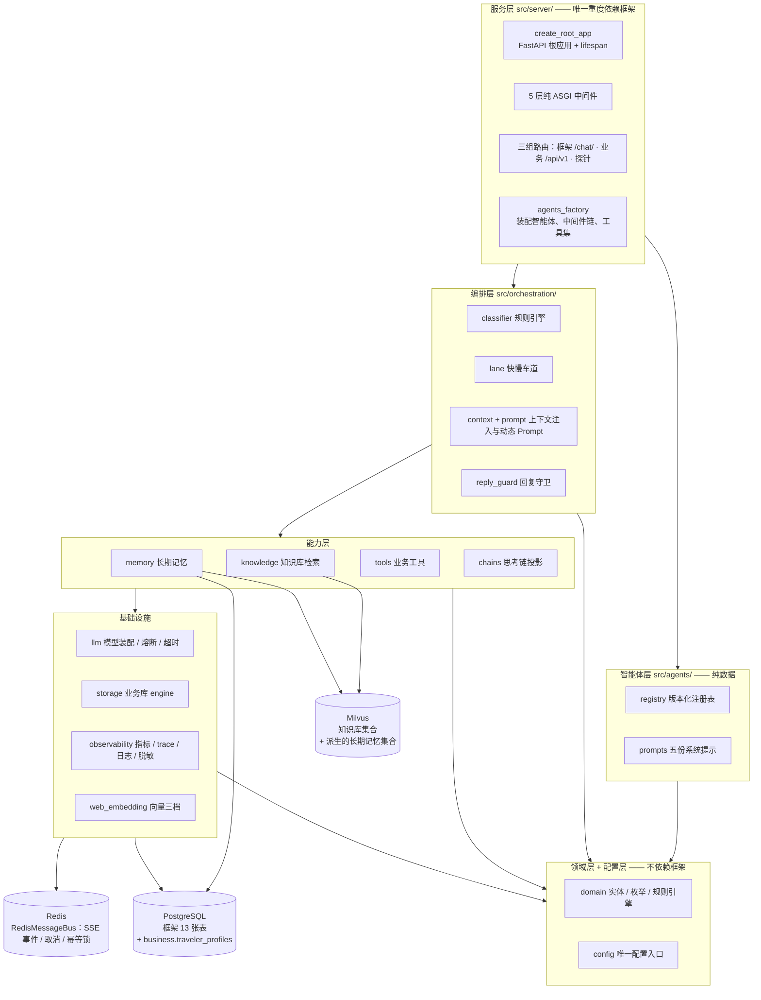

**三种存储各存什么**（这张表比图更重要）：

| 存储 | 存什么 | 谁在用 | 证据 |
| --- | --- | --- | --- |
| **PostgreSQL** | 框架自带 13 张表（会话 / 消息 / 智能体 / 知识文档…）+ 本项目**唯一**自建业务表 `traveler_profiles` | 框架会话、结构化画像 | `src/storage/__init__.py:10` |
| **Redis** | `RedisMessageBus`：SSE 事件总线、取消广播、**每轮对话的幂等锁** | 框架（本项目只构造不实现） | `src/server/app.py:287-302` |
| **Milvus** | 政策知识库单集合 + 派生的长期记忆集合 | `src/knowledge/`、`src/memory/` | `src/knowledge/manager.py` |

⚠️ **业务实体（机票 / 酒店 / 订单 / 申请单）当前是内存仓储**，
不是数据库表——`src/server/agents_factory.py:151` 的注释写明「P3 阶段是**内存实现**，P4 换成 Postgres」。
画图时把 `traveler_profiles` 之外的业务实体画进 Postgres 是错的。

---

## 二、多智能体装配

**5 个智能体**，由一张**版本化注册表**统一装配，单一事实源是 `AgentName` 枚举。

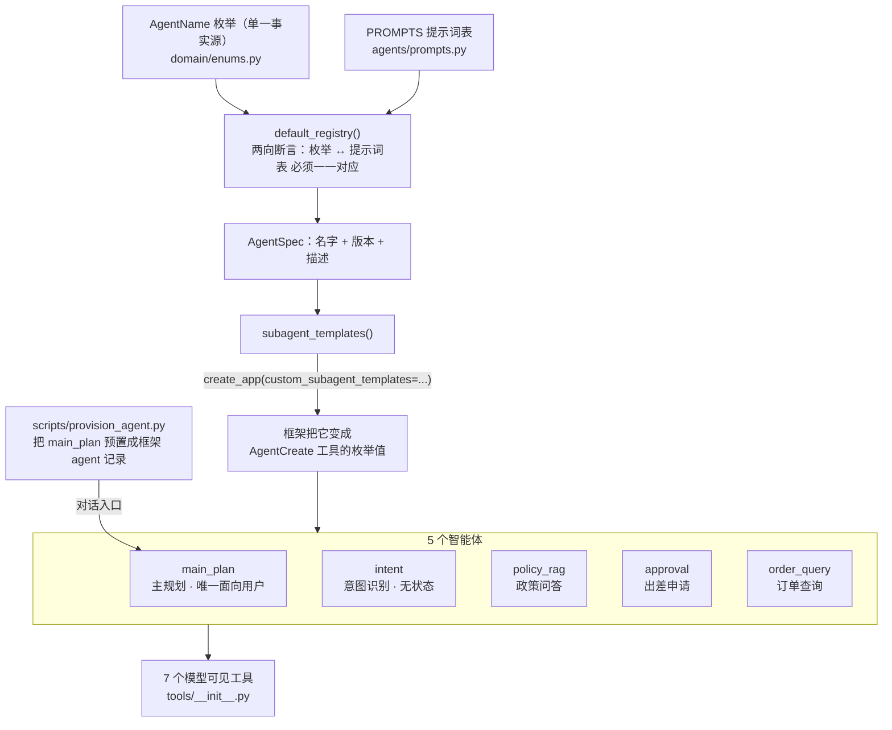

要点，逐条都有代码依据：

- **5 个都进模板**——`subagent_templates()` 遍历注册表全部成员，
  没有「排除主智能体」的特判（`src/agents/registry.py:351-375`）。
- **`main_plan` 额外被预置**成框架的 agent 记录，作为前端对话的入口
  （`scripts/provision_agent.py:305`）。名字必须是 `main_plan`，
  因为 `LaneRouterMiddleware` 只对它生效——`provision_agent.py:29` 的注释专门解释了这一点。
- **注册表有双向断言**：枚举里有、提示词表里没有 ⇒ 抛错；反之也抛错。
  防的是「某个智能体悄悄拿到兜底提示词、专业约束消失而**不报错**」
  （`src/agents/registry.py:435`）。
- 版本号 `_VERSION` 是**集中一个常量**，不是分散写在各 spec 里——
  改版本是整体动作（`src/agents/registry.py:418`）。

### 7 个模型可见工具

| 工具 | 只读 | 作用 | 证据 |
| --- | --- | --- | --- |
| `aligo_route_intent` | ✅ | 路由决策，快车道合成的就是它 | `src/tools/route.py:85` |
| `search_transport` | ✅ | 交通查询 | `src/tools/travel.py:603` |
| `search_hotels` | ✅ | 酒店查询 | `src/tools/travel.py:604` |
| `check_travel_policy` | ✅ | 差标核对 | `src/tools/travel.py:605` |
| `query_orders` | ✅ | 订单 / 申请单查询 | `src/tools/orders.py:263` |
| `submit_approval` | ❌ | 提交申请单，**触发 HITL 人工确认** | `src/tools/orders.py:268` |
| `recognize_intent` | ✅ | 意图识别，由 `extra` 参数注入 | `src/tools/expert.py:119` |

⚠️ **写工具与只读工具的分界就是 HITL 的分界**：有副作用的工具不给 `permission`，
权限引擎默认给 `ASK`，框架发 `RequireUserConfirmEvent` 并暂停
（`src/tools/orders.py:17-21`）。只读工具走只读快速通道，不确认。

---

## 三、一次对话的端到端时序

**关键：SSE 主干是框架的，不是本仓库的。**

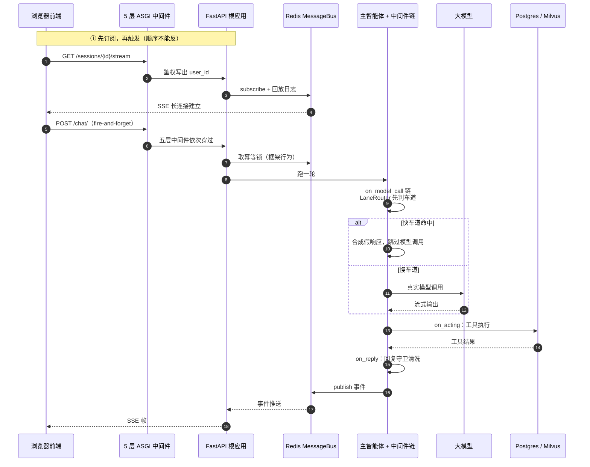

### ASGI 中间件的执行顺序（由外到内）

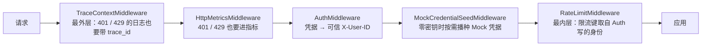

⚠️ **这里有个必错点**：Starlette 的 `add_middleware` 是 `insert(0, ...)`，
所以**代码里书写顺序与执行顺序完全相反**——
源码里写的列表是 `[RateLimit, MockCredentialSeed, Auth, HttpMetrics, TraceContext]`，
而实际执行是 `TraceContext → HttpMetrics → Auth → MockCredentialSeed → RateLimit`
（`src/server/app.py:953-963`、`src/server/app.py:1010-1030`）。

⚠️ **还有一个容易踩的陈旧注释**：`src/server/app.py:969-971` 写的目标链是
**四层**（`TraceContext → HttpMetrics → Auth → RateLimit`，标着「P2 完整版」），
**漏了 `MockCredentialSeedMiddleware`**。实际装配是五层，
五层版写在 `src/server/middleware/mock_credential.py:33-34`。照 `app.py:971` 画会漏一格。

**顺序不是风格，是语义**，四条理由都写在代码注释里：

| 约束 | 理由 | 证据 |
| --- | --- | --- |
| `TraceContext` 最外 | trace_id 必须在进入任何其他中间件前绑好 | `src/server/app.py:972-976` |
| `HttpMetrics` 在 `Auth` 外 | 401 / 429 也要进指标 | `src/server/app.py:980-982` |
| `RateLimit` 在 `Auth` 内 | 限流键要读 Auth 写进 scope 的身份 | `src/server/app.py:986-988` |
| `MockCredentialSeed` 在两者之间 | 要读 Auth 的身份，又不该被一次 DB 写入拖慢限流 | `src/server/app.py:1012-1014` |

三条中间件一律**纯 ASGI，禁用 `BaseHTTPMiddleware`**——后者会缓冲整个响应体，
SSE 在它上面一个字节都读不出来（`src/server/middleware/__init__.py:50-60`）。

### `user_id` 是怎么一路传下去的

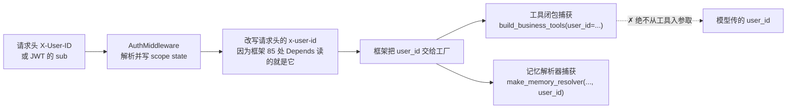

⚠️ 工具侧的铁律：**`user_id` 绝不从工具入参取**——
`src/tools/orders.py:83-86` 的原话是「让模型传 user_id 等于把租户隔离交给模型」。

⚠️ 白名单路径也会**剥离**客户端自带的 `x-user-id` 头（`src/server/middleware/auth.py:327-336`），
否则伪造身份就能绕过隔离。

---

## 四、中间件链：两种不同的「顺序」语义

这是最容易画错的一张。**同一个中间件列表，在不同钩子上是两种不同的组合方式。**

### 4.1 `on_model_call` / `on_reply` / `on_acting` —— 洋葱式

列表**下标 0 是最外层**，逐层包住里面的（`src/server/agents_factory.py:513-517`）。

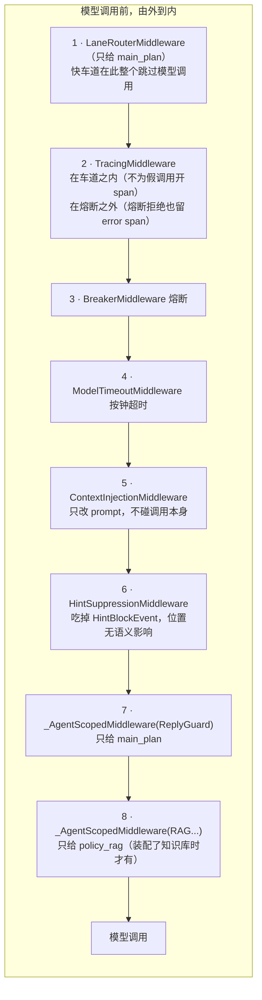

每一段的位置都有理由，而且**理由都是「反了会静默出错」**：

- `LaneRouter` 必须最外：排在别的 `on_model_call` 后面的话，
  熔断器照常记账、trace 照常开 span，**快车道省下的成本被它们的开销吃掉**。
- `Tracing` 必须比熔断**外**：熔断 open 时直接抛 `CircuitBreakerOpen`，
  躲在里面的话「这次调用被熔断拒绝了」在 trace 里**完全不存在**——
  而「这段为什么没有 span」恰恰是最需要证据的地方。
- `Tracing` 又必须比车道**内**：快车道命中时根本不发生模型调用，
  排在车道外面会**为一个不存在的调用开一个 span，记下一条「成功的模型调用」**。
- `Breaker` 在 tracing 之内：把「没调用」记成「调用成功」会稀释失败率，
  **让熔断点被推迟**。
- `ModelTimeout` 在熔断**之内**：熔断器要先看到失败才可能开路，
  而它短路时压根不往下调——超时放外面等于给一个已经决定不打的调用再架一个时钟。
- `ReplyGuard` 必须排在 `on_reply` 的链尾而不是塞进上面几段：
  它要剥的是**模型输出**，无权也不该改动 prompt 与模型调用本身。

证据：`src/server/agents_factory.py:519-575`（逐段理由）、`:669-719`（实际列表）。

### 4.2 `on_system_prompt` —— 串行链式，不是洋葱

⚠️ 同一个列表，在 `on_system_prompt` 钩子上**不是洋葱**：
它是**串行链**，后一个中间件拿到的 `current_prompt` 是前一个的**返回值**
直接往下传（`src/server/agents_factory.py:550-553`）。

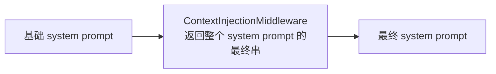

由此得出两条**反直觉**的推论：

1. `ContextInjectionMiddleware` 必须是**最后一个 `on_system_prompt` 实现者**——
   它要看到「基础 prompt + 前面所有中间件的产出」。
2. 但「链尾」**不等于「列表最后一格」**：框架按 `is_implemented("on_system_prompt")`
   过滤后才组成串行链，不实现这个钩子的中间件**根本不进去**
   （`src/server/agents_factory.py:555-558`）。
   所以第 7、8 段那两个作用域包装可以安全地排在它后面。

---

## 五、快慢车道分流

上游博客第二阶段的核心设计，本项目**已实现**，且做法比博客更进一步——
不是「选一个 Prompt 模板」，而是**在中间件里短路模型调用本身**。

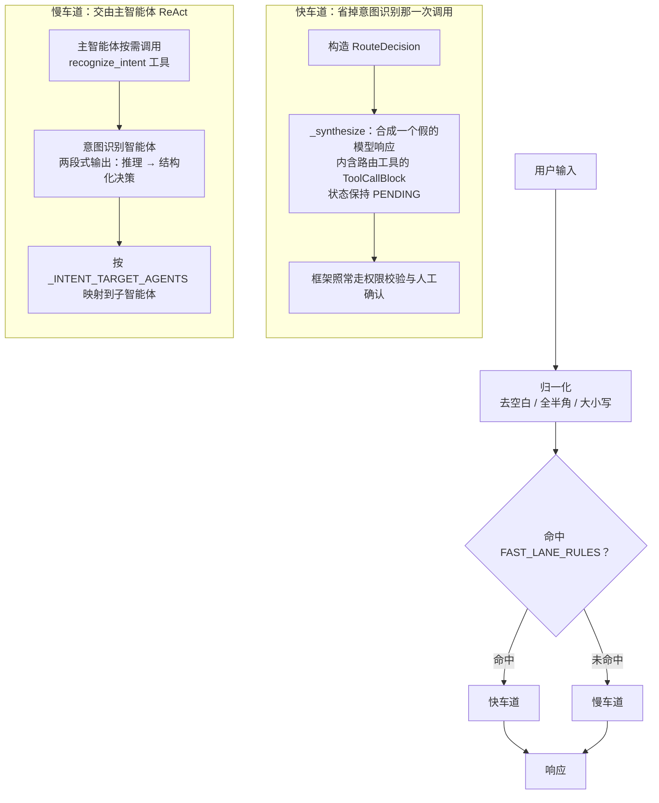

三个必须说准的点：

1. **快车道省的是「意图识别那一次调用」，不是全部调用。**
   总调用数是 **1 而不是 0**。写成「零模型调用」是错的。
2. **它不绕过框架状态机。** 合成的假响应里，路由工具的 ToolCallBlock
   状态**保持 PENDING**，于是权限校验与人工确认照常触发。
   自己重写一遍状态机省不了多少行，却要重新实现框架的权限语义
   （`src/orchestration/lane.py:392`、`:668`）。
3. **路由工具必须出现在工具表里**，否则框架找不到这个名字，
   会把合成调用变成一个 `ToolNotFoundError` 的工具结果**交给模型**
   （不抛异常），于是快车道**静默失效**，日志里只有一条不起眼的工具失败
   （`src/tools/__init__.py:138-142`）。

### 单一事实源：`_INTENT_TARGET_AGENTS`

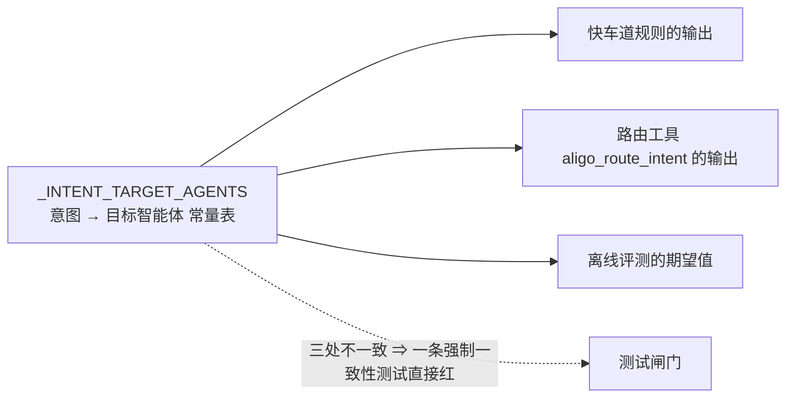

这张表同时驱动三处，是「单一事实源 + 可执行闸门」的典型
（`src/orchestration/classifier.py:70`，在 `:458`、`:501`、`:518` 三处统一取用）。

**一个实测事故**：查「住宿标准」前 7 次都是 4~7 秒直达，
第 8 次模型突然去组队、拉成员、派任务，**耗时 50.6 秒**。
修法是**确定性收窄工具集**——这类意图下只给模型该看到的工具
（`src/orchestration/lane.py:207-216`）。

---

## 六、回复守卫

`src/orchestration/reply_guard.py`，5021 行。它只包在 `_AgentScopedMiddleware` 里
给 `main_plan`——因为**子智能体的输出不面向用户**，它以 HintBlock 回到主智能体。
让守卫也处理子智能体，会把它写给主智能体的「检索结论」当草稿剥掉，
那不是清理，那是把数据删了（`src/server/agents_factory.py:703-708`）。

### 6.1 七条通道

文件自己声明覆盖**七条上屏且落库的通道**（`src/orchestration/reply_guard.py:12`），
每条都按「**先拼完整、再洗**」做——不逐块清洗，因为标记会被块边界拦腰截断。

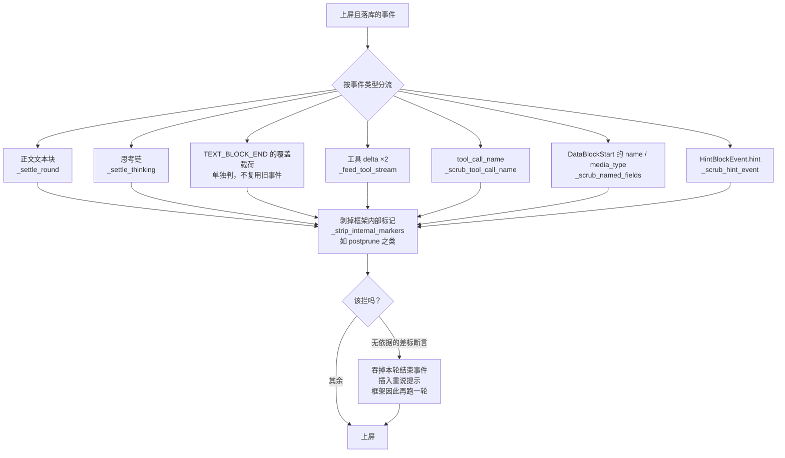

⚠️ **「七条」的计数口径不干净**，照抄时留意：源码 :12 说七条；
但 :238-239 又说「`hint` / `tool_call_name` / `name` / `media_type` 四条通道补齐」，
:2401 说 `hint` 是「**第五条**」。图上写「7 条（文件自称）」即可，
不要试图凑出一个精确枚举。

⚠️ **不要把它画成一个「无依据数字」闸门——是两个**：

| 闸门 | 行号 | 行为 |
| --- | --- | --- |
| `_ungrounded_amounts` | `reply_guard.py:2946` | **只上报，不拦截** |
| `_ungrounded_limit_claims` | `reply_guard.py:2986` | **可拦截**，前置条件是「本轮真的调过差标工具」 |

### 6.2 「扣留宽、删除窄」

这是整份代码里最重要的一条原则（原文 `reply_guard.py:40-43`）：

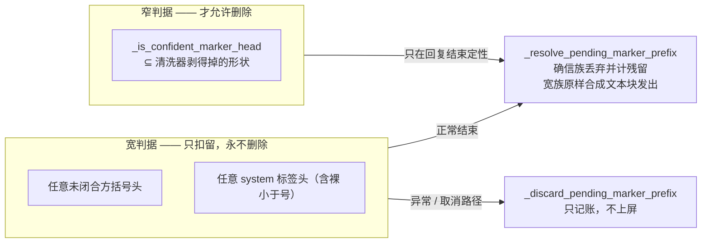

**为什么宽的这一半永不删除**：流一旦发出去就收不回来。把不确定的东西**攥住**，
最坏是晚一点发；删错了则是**内容凭空消失**，而且没有任何报错。

⚠️ 块边界是**另一条缝**：标记被边界拦腰截断时，两半会各自通过清洗、
**拼起来才是完整标记**（`reply_guard.py:35-39`）。所以工具流按流「留尾」缓冲
`_TOOL_STREAM_HOLDBACK = 512`（`reply_guard.py:1896`）。

### 6.3 重试：吞掉结束事件

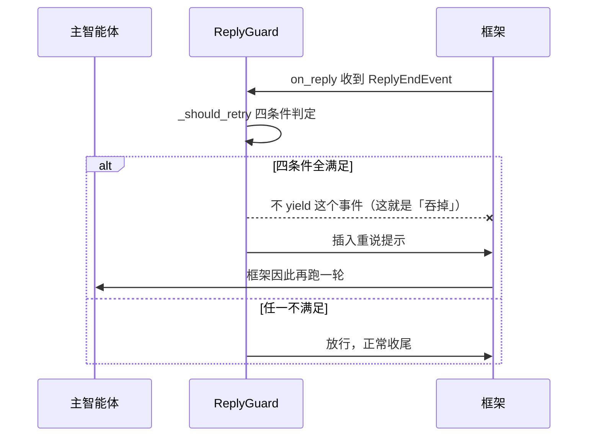

四个前置条件（`reply_guard.py:4615-4622`）：**未发过正文** / 还有额度 /
结束原因是 `COMPLETED` / 迭代余量够。
⚠️ 「**已经发过正文就绝不重试**」——否则用户会看到翻倍的内容。

⚠️ **异常轮走同一条流水线**，不是提前 return
（`reply_guard.py:4331-4332`，早期版本整轮放行，是 2026-10-04 复现出来的缺陷）。
⚠️ 兜底话术**只在 `COMPLETED` 时补**——中断或超迭代不补
（`reply_guard.py:3689-3691`），否则会对着一个被取消的回复说「未能完成」。

---

## 七、RAG 检索与护栏

RAG 最容易骗人的地方，是**它从不报错**。这一节画的正是那些「不报错、结果却全错」的防线。

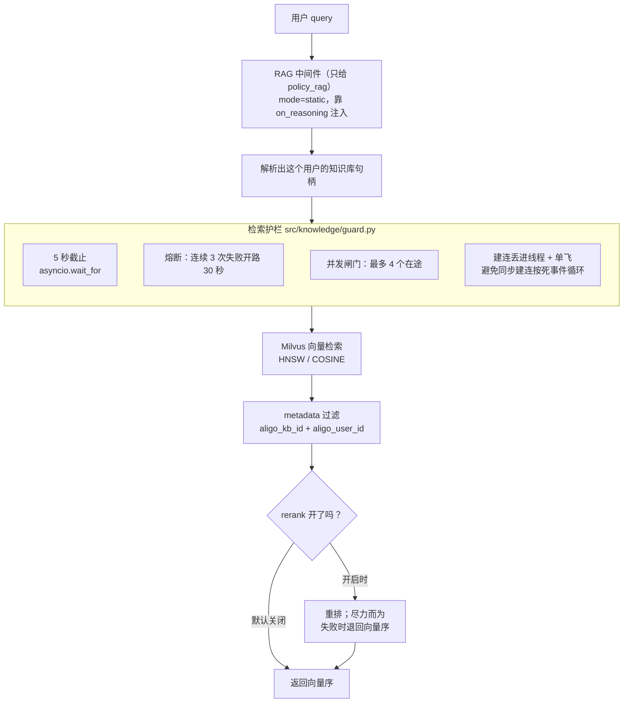

⚠️ **这三样护栏全在 `src/knowledge/guard.py`，不在 `rag.py`。**
`rag.py` 只负责装配（`build_rag_middlewares`）与句柄解析。
`rag.py` 里另有一个同名概念的单飞（`_inflight_for`）是**句柄解析**用的，
与建连预热是**两个东西**，别画成一个。

### 7.1 建集合：「幂等」不等于「确保它是对的」

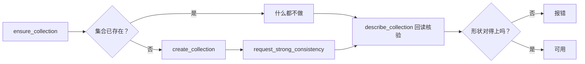

这里有个很硬的取舍，代码注释写得很直白（`src/knowledge/store.py:203-204`）：

> 「幂等」= 集合已存在就不动它，**不是**「确保它是对的」。

于是**用错参数建出来的集合会一直错下去**。最坏的一种错法毫无症状：
维度一样、配置一样、**度量不同**（建时 L2、配置写 COSINE），
**写入成功、检索成功、有分数**，只是分数的大小关系没有意义。
所以必须**回读核验**，而不是相信「建成功了」（`src/knowledge/store.py:256-258`）。

⚠️ 一致性级别**只在建集合那一刻能定**，所以那个函数叫 `request_` 而不是 `set_`
（`src/knowledge/store.py:232-236`）；`CONSISTENCY_LEVEL = "Strong"`（`:73`）。

**为什么非要强一致**：默认级别下，删除后 **0.56s / 0.57s / 0.58s**
那条笔记仍能被召回——用户点了「忘掉」，助手下一句又提起。
实测数据就写在代码注释里。

### 7.2 切分与追溯链


按字数切会把「一线城市住宿限额 700 元」从中间截断；
按小节切保证一个 chunk 是**一条完整规则**。

前缀是**写进向量内容里的追溯链**，不是元数据装饰——
它让检索到的一段能回溯到**具体条款**（`scripts/seed_data.py:1181`）。

### 7.3 多租户：过滤键与「写入端也是强制的」

| 键 | 常量 | 定义 |
| --- | --- | --- |
| 知识库 | `aligo_kb_id` | `src/knowledge/manager.py:81` |
| 用户 | `aligo_user_id` | `src/knowledge/manager.py:82` |

读取端由本项目传 `metadata_filter`（`manager.py:479`）；
**写入端由框架强制**把这两个键写给每一个 chunk（`manager.py:29-32`）。

⚠️ 本项目**永不 `delete_collection`**，删除一律按 metadata 限定范围
（`manager.py:274-307`）——这是「一套集合承载全部知识库」的前提。

⚠️ 隔离粒度是**用户级**，不是企业级。全仓库没有任何 `tenant_id` / `org_id` /
`enterprise_id` 实体。画「多企业隔离」是错的。

### 7.4 向量模型的降级链

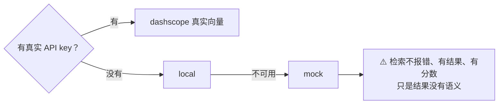

降级链 `("dashscope", "local", "mock")` 定义在 `src/web_embedding/factory.py:29`。
Mock 档的危险性在于**从输出根本看不出来**——这正是第 89 行那条提醒的由来。

---

## 八、双层记忆

两路记忆的边界是**有理由**的，不是「都存一份」。

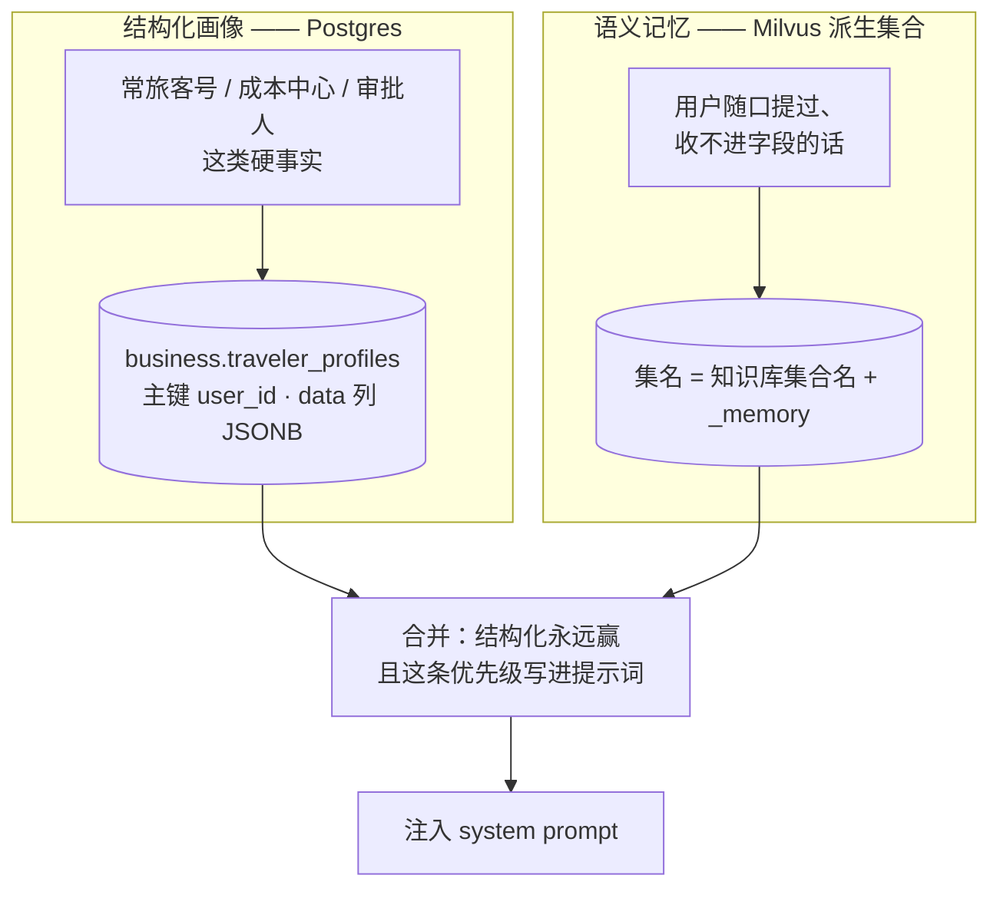

### 为什么硬事实不用向量库

两个理由，都不是「性能」：

1. **常旅客号是精确值**，而向量检索是**近似最近邻**——
   它会把**相似但不等**的号排在前面。对硬事实来说这是灾难。
2. **「换座位」是更新，向量库却是追加。** 语义上就不匹配。

### 非对称容错

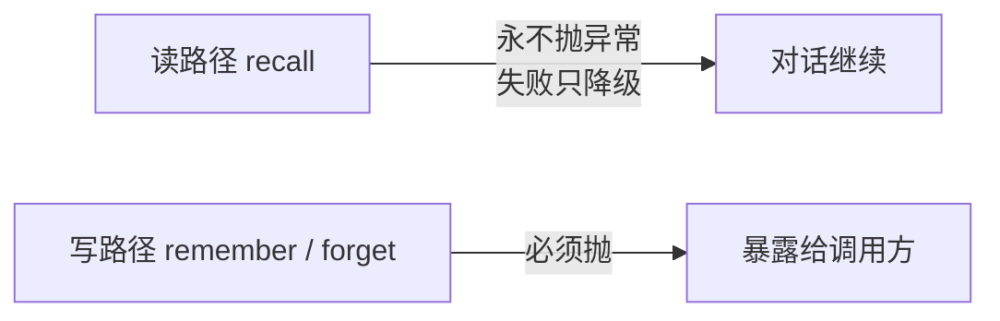

原文（`src/memory/service.py:29-34`）：
「读失败只影响**锦上添花**，写失败是**欺骗**。」

### 三个必须画准的细节

1. **幂等键**取 `sha256(user_id + NUL + text)`（`src/memory/semantic.py:136-137`）。
   为什么要去重？**不是为了省空间**——Top-K 里两条一样的笔记会**挤掉别的笔记的位置**。
2. **记忆集合是派生的**（`{知识库集合名}_memory`，`semantic.py:89`）。
   因为运维修政策库的标准动作是「删掉集合重跑」——笔记若也住里面，
   一次修复会顺手抹掉所有人的长期记忆，**且没有任何报错**。
3. **`user_id` 在装配期被闭包捕获**，不从运行时读 agent——
   否则会串到别人画像（`src/memory/resolver.py:106-118`）。

### 读写面

| 端点 | 作用 |
| --- | --- |
| `GET /api/v1/memory/profile` | 读结构化画像 |
| `PUT /api/v1/memory/profile` | 覆盖结构化画像 |
| `POST /api/v1/memory/notes` | 写一条语义笔记 |
| `GET /api/v1/memory/notes` | 列语义笔记 |
| `DELETE /api/v1/memory/notes` | 忘掉 |

⚠️ **召回是每轮自动注入的，写入要走显式接口。**
对话里说「记住这个」**不会**触发写入——工具面里没有记忆工具。

⚠️ **ReMe 适配层已实现但未接线**：开关 `reme_enabled` 默认 false
（`src/config/schema.py:351`），而且即使打开，全仓库也**没有任何地方调用
`build_reme`**——它只被定义和导出。

---

## 九、动态 Prompt 与 TripStage

⚠️ **先说最容易画错的一点：本项目的「阶段」不是状态机转换，是推断。**

源码里**没有**任何「状态 A → 状态 B」的转换代码。阶段的来源是这样的：

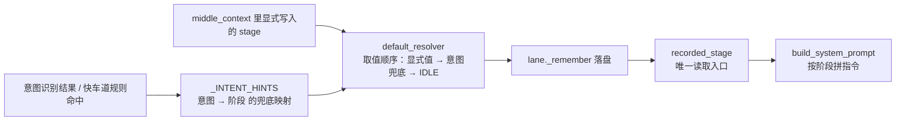

`_INTENT_HINTS` 只映射**两个**意图（`PLAN_TRIP` / `MODIFY_TRIP` → `COLLECTING`），
其余全部落回 `IDLE`（`src/orchestration/context.py:198-201`）。

⚠️ **顺序不能反**：显式写入的 stage **优先于**按意图推出来的。
反了会让「用户已经填到 `CONFIRMING`，这一轮又说了句『规划行程』」
被打回 `COLLECTING`，表现为**方案被反复要求重填**
（`src/orchestration/context.py:214-217`）。

`TripStage` 有 **5** 个成员（`src/domain/enums.py:248-273`）：

| 成员 | 含义 | 有写入方吗 |
| --- | --- | --- |
| `IDLE` | 尚未开始：用户还没表达出差意图 | ✅ 默认值 |
| `COLLECTING` | 收集中：正在补齐必填要素（可多轮） | ✅ 意图映射 |
| `CONFIRMING` | 待确认：要素齐全，已生成方案 | ⚠️ 无写入方 |
| `DONE` | 已完成：方案已确认 | ⚠️ 无写入方 |
| `CANCELLED` | 已取消：终端态 | ⚠️ 无写入方 |

三个「无写入方」的状态**有指令文本、但没有代码会把阶段推进到那里**。
画图时请标成「映射/推断」，不要画成状态机转换箭头。

### prompt 组装顺序

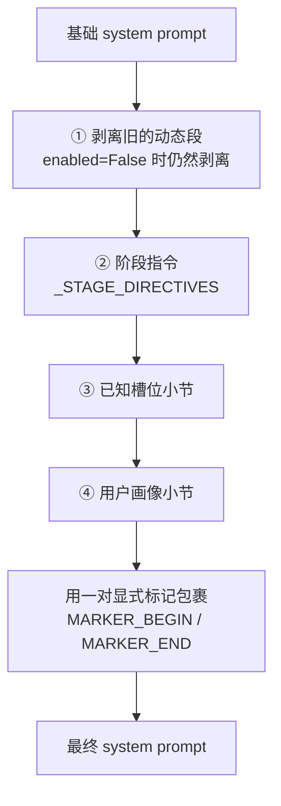

**幂等靠那对标记**：每次组装先把上一次的动态段整段剥掉再加，
所以不会越拼越长（`src/orchestration/prompt.py:385-445`，
标记常量在 `:68`）。

⚠️ `ContextInjectionMiddleware` 挂在 `on_system_prompt` 钩子上
（`src/orchestration/context.py:301`），而这个钩子是**串行链式**的，
参见第四节 4.2——它**必须挂在链尾**（`:262`）。

⚠️ 画像小节在提示词里明确写着「**仅供参考**」「不得据此推断本次出差的具体要素」
（`src/orchestration/prompt.py:428-438`）——
因为语义记忆带分数、是近似的，不能当事实用。

## 十、部署档位

13 个 compose 服务分四档，**档位之间是叠加关系，不是互斥关系**。

```mermaid
flowchart TB
    subgraph CORE["core 档 · 6 个 · make up"]
        direction LR
        PG["postgres<br/>5432:5432"]
        RD["redis<br/>6379:6379"]
        ETCD["etcd<br/>无端口映射"]
        MINIO["minio<br/>9000 / 9001"]
        MV["milvus<br/>19530 / 9091"]
        APP["app<br/>8000"]
    end

    subgraph OBS["observability 档 · 2 个 · make up-obs"]
        direction LR
        PROM["prometheus<br/>9090"]
        GRAF["grafana<br/>3000"]
    end

    subgraph TRC["tracing 档 · 4 个 · make up-tracing"]
        direction LR
        LF["langfuse<br/>3001:3000"]
        LFW["langfuse-worker"]
        CH["clickhouse"]
        LFR["langfuse-redis"]
    end

    subgraph OPT["optional 档 · 1 个 · make up-optional"]
        MK["maxkb<br/>8080"]
    end

    APP -->|depends_on| PG
    APP -->|depends_on| RD
    APP -->|depends_on| MV
    MV -->|depends_on| ETCD
    MV -->|depends_on| MINIO

    PROM -->|抓取 app:8000/metrics| APP
    GRAF --> PROM
    LF --> PG
    LF --> CH
    LF --> LFR
```

⚠️ **四个最容易画错的连线**：

1. **`app` 只依赖三个服务**：postgres / redis / milvus。
   **不依赖 etcd / minio**——那两个是 Milvus 的依赖
   （`docker-compose.yaml:465-471`、`:393-397`）。
   把 etcd / minio 连到 app 是错的。
2. **`make up-optional` 不含 core**。它只起 maxkb 一个容器（`Makefile:347-349`），
   所以「optional = core + maxkb」是错的。
3. **跨档依赖必须显式一并启用**。compose 不会自动把被依赖的档拉起来：
   `--profile tracing` 单独跑会直接判非法（`rc=15`），
   因为 langfuse 依赖 core 档的 postgres / minio（`docker-compose.yaml:36-45`）。
4. **`app.workers` 默认 1 是正确性约束，不是性能默认**——
   `SchedulerManager` 每个 worker 各触发一次 cron
   （`config/base.yaml:47`）。画「横向扩多副本」前先看这条。

### 探针的分工（反直觉，别画错）

| 端点 | 检查什么 | 谁在用 |
| --- | --- | --- |
| `/healthz` | **零 I/O**，恒 200 | 镜像级 `HEALTHCHECK`（`Dockerfile:174-175`） |
| `/readyz` | 并发 4 项：postgres / redis / milvus / boot | compose 覆盖成 `readyz`（`docker-compose.yaml:460`） |
| `/metrics` | Prometheus 文本；关闭时返 **404** 而非空 200 | Prometheus 抓取 |

⚠️ **Milvus 挂了 `/readyz` 仍然返回 200。**
必需项只有 `{postgres, redis, boot}`——Milvus **刻意不阻断就绪**，
因为只有「查差旅政策」一条路径用它，把它算进去等于用
「政策问答不可用」的代价换来「整个服务不可用」。
但**检查仍然执行、结果仍然出现在响应体里**——
「不阻断」不等于「不报告」（`src/server/probes.py:83-103`）。

---

## 附：这些图与代码的对应关系

本文所有 Mermaid 图都是**手写**的（仓库不生成图），
所以图与代码之间可能漂移。改动下列文件时请回头看一眼对应的图：

| 图 | 会让它过期的改动 |
| --- | --- |
| 一、整体架构 | 新增 `src/` 顶层包、换存储 |
| 二、多智能体装配 | `AgentName` 增删成员、工具表增删 |
| 三、端到端时序 | 中间件增删、`user_id` 传递路径变化 |
| 四、中间件链 | `agents_factory` 里的中间件列表顺序 |
| 五、快慢车道 | `FAST_LANE_RULES` 或合成响应的做法 |
| 六、回复守卫 | 通道增删、重试条件 |
| 七、RAG 与护栏 | `guard.py` 的阈值、过滤键 |
| 八、双层记忆 | 记忆分层或合并规则 |
| 九、动态 Prompt | `TripStage` 成员、组装顺序 |
| 十、部署档位 | `docker-compose.yaml` 的服务或 profile |

`make check-docs` 会校验本文的行号引用没有超界；
但**它查不出「行号对了、内容变了」**——那需要人看一眼。
